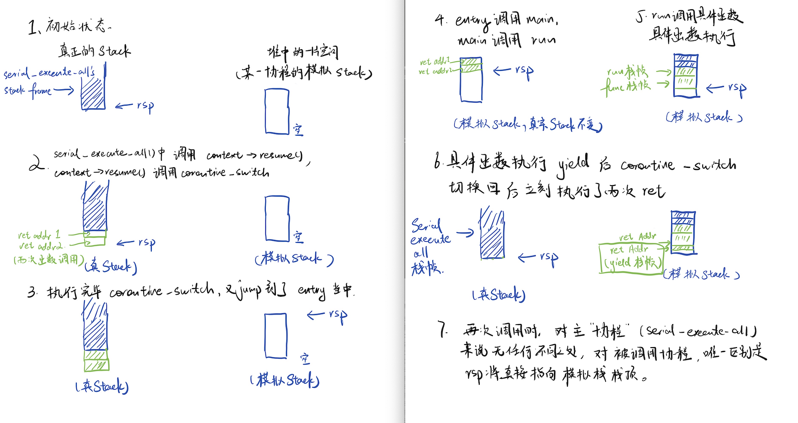
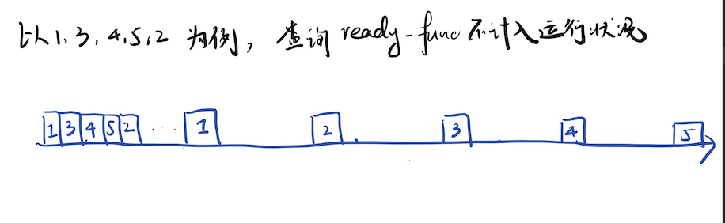
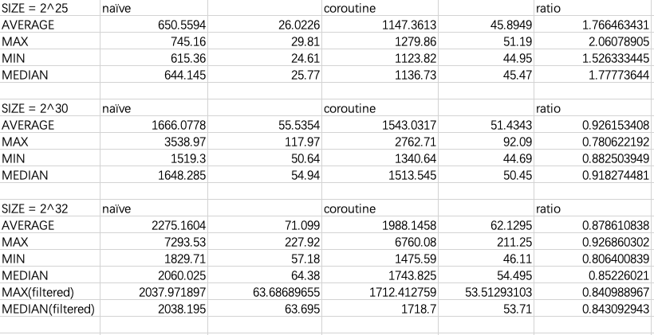
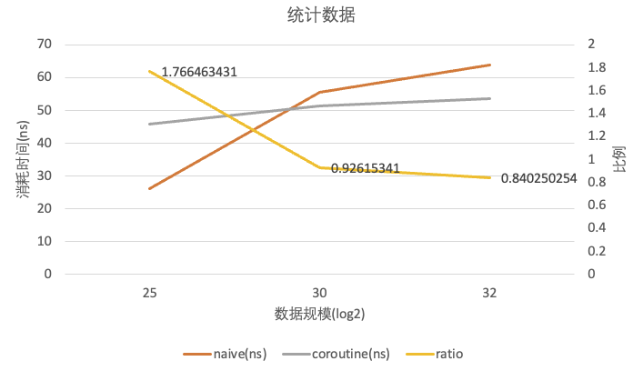
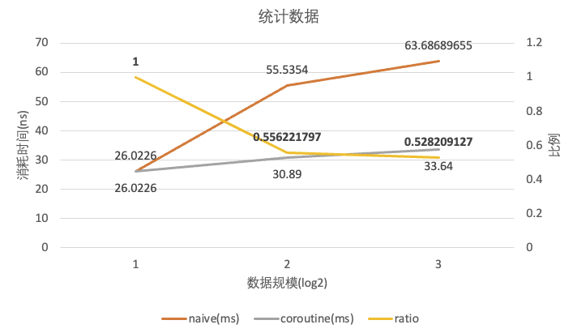

# 协程实验报告

## Task 1:

#### 代码填写：

```cpp
void yield() {
  if (!g_pool->is_parallel) {
    // 从 g_pool 中获取当前协程状态
    // 为了保证通用性，我们不能修改具体执行函数让其来存储目前执行的协程序号
    // 所以通过当前协程池的 context_id 来确定目前处在的协程，而且每次切换协程时需要修改 context_id
    auto context = g_pool->coroutines[g_pool->context_id];
    // 调用 coroutine_switch 切换到 coroutine_pool 上下文
    // 暂停当前协程，回到（负责切换协程的）父函数，因此参数中前者是 callee, 后者是 caller
    coroutine_switch(context->callee_registers, context->caller_registers);
  }
}
```

```cpp
virtual void resume() {
// 调用 coroutine_switch
    coroutine_switch(caller_registers, callee_registers);
// 在汇编中保存 callee-saved 寄存器，设置协程函数栈帧，然后将 rip 恢复到协程 yield 之后所需要执行的指令地址。
// 当前函数所处环境即为 caller 。看似处在一个子函数里，但切换回当前环境后，下一句语句即为执行返回，回到负责调度协程的父函数。
}
```

```assembly
.global coroutine_switch
coroutine_switch:
    # TODO: Task 1
    # 保存 callee-saved 寄存器到 %rdi 指向的上下文
    # 由于调用 yield 和 coroutine_switch 仍然是调用函数的样子，因此 caller_saved regs 会在进入 coroutine_switch 前被保存在栈上，无需手动保存。
    movq  %rsp, 64(%rdi)
    movq  %rbx, 72(%rdi)
    movq  %rbp, 80(%rdi)
    movq  %r12, 88(%rdi)
    movq  %r13, 96(%rdi)
    movq  %r14, 104(%rdi)
    movq  %r15, 112(%rdi)

    # 保存的上下文中 rip 指向 ret 指令的地址（.coroutine_ret）
    # 使用 %rbx 作为临时寄存器完成这一操作
    leaq .coroutine_ret(%rip), %rbx
    movq  %rbx, 120(%rdi)


    # 从 %rsi 指向的上下文恢复 callee-saved 寄存器
    movq  64(%rsi),  %rsp
    movq  72(%rsi), %rbx
    movq  80(%rsi), %rbp
    movq  88(%rsi),  %r12
    movq  96(%rsi),  %r13
    movq  104(%rsi),  %r14
    movq  112(%rsi),  %r15

    jmpq  *120(%rsi)
    # 最后 jmpq 到上下文保存的 rip
    # 虽然难以直接修改 %rip 寄存器，但是可以使用 jmpq 跳转到应该去往的地址。大部分情况下执行的就是 ret 语句，但是当初次访问一些协程的时候我们访问的是 coroutine_entry 而非 .coroutine_ret， 因此在这里不能直接写 ret. 
```

对于 `void serial_execute_all()` 函数中填空内容， Task2 所实现的功能为 Task1 的超集，因此留待后文解释，此处不作赘述。

#### 阅读要求：

```cpp
// TODO: Task 1
    // 在实验报告中分析以下代码
    // 对齐到 16 字节边界
    uint64_t rsp = (uint64_t)&stack[stack_size - 1];
    rsp = rsp - (rsp & 0xF);

    void coroutine_main(struct basic_context * context);

    callee_registers[(int)Registers::RSP] = rsp;
    // 协程入口是 coroutine_entry
    callee_registers[(int)Registers::RIP] = (uint64_t)coroutine_entry;
    // 设置 r12 寄存器为 coroutine_main 的地址
    callee_registers[(int)Registers::R12] = (uint64_t)coroutine_main;
    // 设置 r13 寄存器，用于 coroutine_main 的参数
    callee_registers[(int)Registers::R13] = (uint64_t)this;
```

进入一个协程有且只有上下文切换 (coroutine_switch) 一种方法。对于恢复被 yield 的协程，这是很自然的想法。但是对于一个还没有被执行过的协程，这样的做法会显得比较困难，要求我们预先配置好协程的上下文（也就是寄存器）。这段代码起到了这一作用。

rsp 是（协程的）栈指针。对于每个协程，它实际指向堆上的一块足够大的空间空间，以此来模拟协程的栈。 `rsp & 0xF` 操作保证了栈是 16 字节对齐的，以免引发段错误。

除了 rsp 以外，这段代码还初始化了以下的“寄存器”：
- rdi 被设置为 coroutine_entry。
- r12 r13 分别为 coroutine_main 函数以及其参数（即这个结构体自身），供 coroutine_entry 调用。

其余几个寄存器都是空（或者说未设置）的。

首次切换到某一协程后，会首先执行 coroutine_entry, coroutine_entry 配置好参数后，会调用 coroutine_main。对于 coroutine_main 所做的事情见下文。

由于执行 context_switch 时并不会保存/恢复 rdi rsi 这样的存储参数的寄存器，因此需要额外的汇编代码（即 coroutine_entry ）配置这些参数，不能直接将协程的入口设置为 coroutine_main。


```cpp
// TODO: Task 1
// 在实验报告中分析以下代码
void coroutine_main(struct basic_context *context) {
  context->run();
  context->finished = true;
  coroutine_switch(context->callee_registers, context->caller_registers);

  // unreachable
  assert(false);
}
```
第一次（ 使用 context_switch ) 进入某一协程时会调用 coroutine_entry, coroutine_entry 会调用 coroutine_main，这是正常情况下 coroutine_main 唯一一次被调用。
被调用后， coroutine_main 会调用具体要执行的函数的 run() 函数，记为 func 。

- 如果 func 函数在执行过程中 yield() 了，存储的上下文就是 func 函数中的上下文。之后再次进入该协程时，直接回直接回到 func 函数内部，不会涉及 coroutine_main 。
- func 函数执行完毕后，执行 ret, 返回到 coroutine_main 函数中。

返回到 coroutine_main 后，执行的下一句语句就是 context->finished = true，这是合理的（因为具体的函数已经执行完毕了）。接下来会用 context_switch 切换回进入 coroutine_entry 之前的环境（一般情况也就是负责线程调度的父函数）。此后，这一已经被标为 finished 的协程将不再被访问，因此下一语句 assert(false) 自然是 unreachable 的。

#### 上下文切换时的栈帧变化：



## Task 2:

#### 代码填写：

```cpp
void serial_execute_all() {
    is_parallel = false;
    g_pool = this;

    bool all_finished = false;  //用于判断是否全部执行完毕
    while ( !all_finished ){    //没有完毕就开启一次新的轮询
      all_finished = true;
      g_pool->context_id = 0;

      for (auto &context : coroutines) {

        // 如果第一个条件为真，第二个条件就不会被验证，因此不会出现非法访问的情况。
        if ( context == nullptr || context->finished ) {  
          delete context;   // 聪明的编译器会使 delete nullptr 这种情况开销降到可以忽略不计的地步。
          context = nullptr;
        } else {
          if( context->ready || context->ready_func() ) {   // 如果不 ready, 再用 ready_func 验证
            context->ready = true;
            context->resume();
          }
          all_finished = false; //一旦有一个非 finshed 的协成就设置为 false。这么写会多进行一轮轮询，但对效率不会有太大影响 
        }
        g_pool->context_id++;   // 需要设置 context_id 与（下一个）执行的 coroutine 相对应
      }
    }
    coroutines.clear();
  }
```

```cpp
void sleep(uint64_t ms) {
  if (g_pool->is_parallel) {
    auto cur = get_time();
    while (
        std::chrono::duration_cast<std::chrono::milliseconds>(get_time() - cur)
            .count() < ms)
      ;
  } else {
    // 从 g_pool 中获取当前协程状态
    auto context = g_pool->coroutines[g_pool->context_id];
    context->ready = false;

    // 获取当前时间，更新 ready_func
    auto cur = get_time();

    // 使用 lambda 表达式注册 ready_func，按值捕获当前时间和睡眠时长。
    context->ready_func = [cur, ms](){
      // 检查当前时间，如果已经超时，则返回 true
      return std::chrono::duration_cast<std::chrono::milliseconds>(get_time() - cur)
            .count() >= ms;
    };

    // 调用 coroutine_switch 切换到 coroutine_pool 上下文
    coroutine_switch(context->callee_registers, context->caller_registers);

  }
}
```

#### 协程运行状况



#### 更高效的协程库实现

目前的做法是维护一个 Vector, 每一次每一个任务，无论是否完成，都会被查询。

朴素的优化方法是维护一个 FIFO 的队列，依次查询。若一个任务已经完成了，及时将其从队列中踢出（不再放回队尾），这样可以达成常数级别的优化（节省不多于 1/2 的查询时间）。

若要达到更好效果的优化，我们可以部分参考现有的操作系统对进程调度的实现。我们可以要求每一个协程在创建时，根据自身特性，给予调度器一个 “优先级” 值。优先级越高，代表其 yield 所耗费的预期时间越少。对于 sleep_sort 中的函数，这个优先级即可以是其等待的时间。这种做法具有普适性，而且不会因为错误的优先级导致某些协程完全没有机会执行。

在调度时，我们确保每一个协程被执行（即查询 ready_func) 的可能性与其优先级成正比。一个简单（粗糙）的实现是如下：

> the priority value for each coroutine is set within [0,100]
> while ( unfinished )
>   for (i = 0; i < 100; i++ )
>     Try to execute coroutines with priority_val larger than i

每一轮 while 循环中优先级为 10 的协程有 10 次机会被尝试执行，优先级为 100 的协程有 100 次机会被尝试执行，满足了上述要求。这样，我们进行无效的 ready_func 查询的可能性应该会减小。（当然，目前的实现仍然有很多问题，例如时间分布不均等，但是整体的思路应该是有效的）

## Task 3:

#### 代码填写：
```cpp
    // TODO: Task 3
    // 使用 __builtin_prefetch 预取容易产生缓存缺失的内存
    __builtin_prefetch(&table[probe], 0, 3);  // 第一个参数代表只读，第二个参数代表被访问不久之后非常有可能再次访问（需要多保存一段时间）
    yield();      // 并调用 yield
```

#### 性能分析：
在运行中发现，即使已经有了多 loop、 多 batch, 系统性能仍然可能会有不稳定。为了获得相对可靠的结果，对于不同的 l (size) 参数，各重复运行 100 次（ batch size 和 loop 均为默认值），输出内容、处理数据均保存在了 ./material 目录下。以下为数据分析：

共有 size = 2^25, 2^30, 2^32 三组数据。

原始数据保存在相应文件的 original 工作表中。筛选数据表存在 filtered 工作表中（ size = 2^25, 2^30 数据筛选后没有变化），筛选标准为 naive 和 coroutine_batched 花费的时间都在其对应平均值上下 20% 以内。得到结果如下：



可以看出 **数据规模越大，naive 耗时越长；数据规模较小的时候，协程带来的额外花费得不偿失；数据量较大的时候，使用协程有一定优势。**



由于写的协程较为朴素，且会有多次不必要的上下文切换，上下文切换过程中耗费的时间较长。我们不妨考虑手动扣除上下文切换消耗的时间，以 2^25 组数据为基准，视 coroutine 组多花费的时间为上下文切换导致的开销。 在 2^30, 2^32 两组数据中扣除对应的时间，存储在 processed 工作表中。得到的新数据如下：



这时候协程所带来的性能优势和论文中（占用大内存时） 优化至原先 50% 的结果较为相似了。

## 参考资料

向 黄宇翔 请教了如何取得汇编中函数的地址。

参考了:

[南京大学2022操作系统-P20](https://www.bilibili.com/video/BV12a411Y7uW)

[数据预取](https://www.cnblogs.com/dongzhiquan/p/3694858.html)

## 总结和感想

#### 总结

- 对程序的内存布局有了初步的了解。栈内存与堆内存没有本质上的区别，我们可以用堆内存中的一块空间作为模拟栈。代码段也是内存中的一部分。
- 对于函数调用、返回的过程值有了更深入的见解，例如一个函数在 return 之前一定会将栈帧回复成进入前的样子。
- 对于寄存器的使用、 callee-saved 与 caller-saved registers 有了清晰的认识。一些寄存器有特别的功能（例如 rip, rsp 等）。
- 明白了如何将汇编代码与 C++ 代码耦合，例如 extern C 中声明的函数可以直接对应到汇编中的代码段。
- 初步认识了协程、上下文切换等技术。协程切换开销小，在执行一些需要依赖内存、磁盘等“外部”数据、运算的函数时，执行其他协程再返回具有效率上的优越性。


#### 感想

- 计算机系统是一个整体，各个组成部分互相配合，互相制约。在不同场景需要不同的技术来提高效率。
- 对于 C ( C++ ) 程序来说，源代码一般可以与汇编代码良好的对应，无论是程序的执行还是内存的管理都不是“黑盒”，可以良好全面地分析解释。
- 最后，感谢助教！让对系统几乎一无所知的同学也能完成（简单的）协程调度。从原理、实现、改进再到应用，这个 lab 质量实在太高了！

